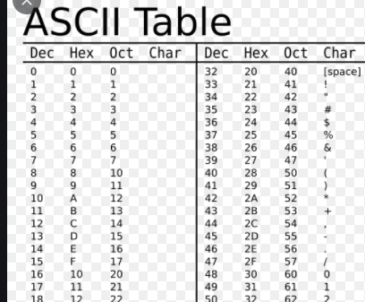

# 자바에서 숫자문자열을 정수로 바꾸는 방법과 ascii에 대하여..

예를 들어서,

```java
String numString = "12345";

// 하나씩 정수로 바꿔본다면,
for (int i = 0; i < numString.length(); ++i) {
    int charInt = numString.charAt(i) - '0';
    
    // 위의 charInt는 각 1,2,3,4,5 정수로 각각 사용할 수 있다.
}
```

위와 같이 되는 이유는 char 값이 ascii 값이기 때문인데,  
ascii는 가끔 썼지만 저런 곳에 사용하는 것은 처음봐서 포스팅한다.




위와 같이 원래 숫자 0 은 Character 아스키넘버로 48 (Decimal) 이다.

> 0, 1, 2, 3, ...  
아스키 넘버도 마찬가지로  
48, 49, 50, 51, ...

그래서 해당 char (ascii) 에서, 48을 빼주면  
아스키 테이블의 맨 앞의 실제 숫자 정수 0~ 시작하는 숫자로 바꿀 수 있다.


### 추가로.. 참고

a~ z 까지의 뭐 컬럼이나 이런 표기를 숫자로 바꾸고 싶다 하면
```java
int number = numString.charAt(index) - 'a' + 1;
```

코드로 바꿀 수 있다.
