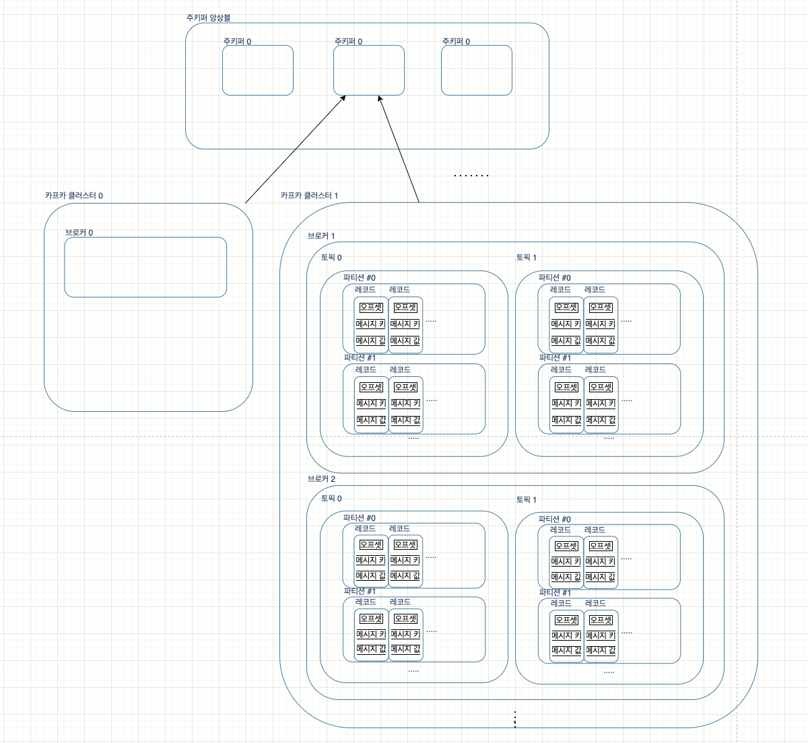

# 아파치 카프카 애플리케이션 프로그래밍 with 자바

## 1.

## 2. 

## 3. 카프카 기본 개념 설명
- 3.1. 카프카 브로커 / 클러스터 / 주키퍼
- 3.2. 토픽과 파티션
- 3.3. 레코드
- 3.4. 카프카 클라이언트
- 3.5. 카프카 스트림즈
- 3.6. 카프카 커넥트
- 3.7. 카프카 미러메이커2
- 3.8. 정리

> 브로커 (내부에 ->)  토픽  (내부에 ->)  파티션

### 3.1. 카프카 브로커 / 클러스터 / 주키퍼
- 카프카 `브로커`
  - 카프카 `클라이언트`와 데이터를 주고받기 위해 사용하는 데이터 분산 저장소 
  - 하나의 서버에는 한 개의 카프카 브로커 프로세스
  - 1대로 기본기능 실행 가능하지만 안전한 보관과 처리를 위해서 3대 이상의 브로커 서버를 1개의 `클러스터`로 묶어서 운영
    - 클러스터로 묶인 브로커들은 프로듀서가 보낸 데이터를 안전하게 분산 저장 및 복제하는 역할 수행
  

- 파일 시스템 (FS)에 저장하기에 파일 입출력으로 속도 이슈가 발생하지 않는가?
  - 카프카는 메모리나 DB에 저장하지 않고 따로 캐시메모리를 구현하지 않는다.
  - 카프카는 `페이지캐시`(Page cache)를 사용
    - 페이지캐시는 OS 에서 파일 입출력 성능향상을 위해 만들어둔 메모리 영역
    - 한번 읽은 내용을 메모리에 넣어둠 (ref: https://brunch.co.kr/@alden/25)
  - 카프카가 캐시를 직접 구현했거나 하면 빈번한 GC 로 속도 손해
  - 위 특징으로, 힙 메모리 사이즈를 크게 설정할 필요가 없다.

- 데이터 복제, 싱크 (replication, sync)
  - 카프카의 데이터 복제는 `파티션` 단위
  - 복제 최솟값은 1(복제없음), 최댓값은 브로커 개수만큼 설정 가능
  - 복제된 파티션은 리더(leader)와 팔로워(follower)로 구성된다.
    - 팔로워 파티션들은 리더 파티션의 오프셋을 확인하여 현재 자신의 오프셋과 차이가 나면 리더로부터 데이터를 가져와서 자신의 파티션에 저장  
      - -> 이것이 복제(replication)
    - 리더 파티션이 있는 브로커에 장애가 발생하면 팔로워 중 하나가 리더가 된다.

- `컨트롤러`(controller)
  - 클러스터의 브로커 중 1대가 컨트롤러의 역할
  - 다른 브로커들의 상태를 체크하고 브로커가 클러스터에서 빠지는 경우, 해당 브로커에 있는 리더 파티션을 재분배
  - 컨트롤러 브로커에 장애가 생기면 다른 브로커가 컨트롤러 역할을 함

- 데이터 삭제
  - 카프카는 `프로듀서`(producer)나 `컨슈머`(consumer)가 삭제 요청을 할 수 없다.
  - 브로커만 데이터를 삭제 가능함
  - 데이터 삭제는 파일 단위(로그 세그먼트)로 이루어짐 (특정 데이터를 선별 삭제 할 수 없다)
  - 설정 용량까지 세그먼트 파일을 열어두고, 용량에 도달하면 세그먼트 파일을 닫는다.
  - 닫힌 세그먼트 파일은 옵션의 설정값에 따라 삭제된다. (용량, 시간)
- 데이터를 삭제하지 않고 메시지 키 기준으로 오래된 데이터 압축하는 정책도 가능하다. (토픽압축정책, ch4)

- 컨슈머 오프셋 저장
  - 컨슈머 그룹은 토픽이 특정 파티션으로부터 데이터를 가져가서 처리하고, 이 파티션의 어느 레코드까지 가져갔는지 확인하기 위해 오프셋을 커밋
  - __consumer_offsets 토픽에 저장됨

- `코디네이터`(coordinator)
  - 컨슈머 그룹의 상태를 체크하고 파티션을 컨슈머와 매칭되도록 분배
  - 컨슈머가 컨슈머 그룹에서 빠지면 매칭되지 않은 파티션을 정상 동작하는 컨슈머로 재할당 (리밸런스, rebalance)

- `주키퍼`(zookeeper)
  - 카프카의 메타데이터를 관리
  - 주키퍼 쉘에서 `znode` 관련 확인 가능
    - znode: 주키퍼에서 사용하는 데이터 저장 단위. FS 처럼 노드간 트리 계층구조
  - 클러스터로 묶인 브로커들은 동일한 경로의 주키퍼 경로로 선언해야 같은 브로커 묶음이 됨
  - 클러스터를 여러개 운영한다면, 1개의 주키퍼에 다수의 클러스터 연결 사용 가능
    - 2개 이상의 카프카 클러스터를 구축할 때는, root znode 한단계 아래에서부터의 znode 들을 브로커 옵션으로 지정 

### 3.2. 토픽과 파티션 
- `토픽`(topic): 카프카에서 데이터를 구분하는 가장 기본적인 개념 (RDBMS 의 테이블과 유사)
  - 1개 이상의 파티션을 소유함
  - `파티션`
    - 카프카 병렬처리의 핵심
    - 컨슈머 개수를 늘리면서 파티션 개수 늘리면 처리량 증가
    - 큐와 같은 FIFO 구조이지만, pop 후 **데이터 삭제 하지 않기 때문에** 여러 컨슈머 그룹이 토픽의 데이터 여러번 가져 갈 수 있음

- 토픽 이름 제약 조건
  - 빈 문자열 x
  - 영어 대소문자, 숫자0~ 9, ., _, - 조합으로 생성 가능하다.
  - 등등

- 토픽 네이밍
  - <환경>.<팀-명>.<애플리케이션-명>.<메시지-타입>
    - prd.marketing-team.sms-platform.json
  - <프로젝트명>.<서비스명>.<환경>.<이벤트명>
    - commerce.payment.prd.notification
  - 등등

### 3.3. 레코드
- `레코드`
    - 타임스탬프 / 메시지 키 / 메시지 값 / 오프셋 / 헤더 ... + 토픽이름, 파티션번호 로 구성되어 있다.
    - `타임스탬프`: 프로듀서에서 레코드 생성 시점의 유닉스 타임 (토픽 설정에 따라서 임의 시간이나, 브로커에 적재된 시간으로 설정 가능)
    - `메시지 키`: 메시지 값을 순서대로 처리하거나 메시지 값의 종류를 나타내기 위해 사용 (메시지 키 해시값으로 파티션 지정하기 때문에, 동일한 키는 동일한 파티션)
        - > 주의: 파티션 개수가 변경되면 메시지 키와 파티션 매칭이 달라짐
        - 키 선언하지 않으면 null (기본 설정 파티셔너에 따라 분배)
    - `메시지 값`: 실제 처리할 데이터
        - 프로듀서로부터 직렬화되어 전송, 컨슈머도 사용 시에는 역직렬화 수행하여 사용
    - `오프셋`: 0 이상의 숫자
        - 직접 지정 할 수 없고, 브로커에 저장 될 때 이전 전송 레코드의 오프셋+1 값으로 생성
        - 카프카 컨슈머가 데이터를 가져갈 때 사용
            - 컨슈머 그룹으로 이루어진 카프카 컨슈머들이 파티션의 데이터를 어디까지 가져갔는지 명확히 함
    - `헤더`: 레코드의 메타데이터 저장
    - 컨슈머에서 참조 가능 (키/값)

### 3.4. 카프카 클라이언트
- 카프카 클라이언트
  - 프로듀서
  - 컨슈머
  - 어드민

- 프로듀서(producer)
  - 데이터를 선언하고 브로커의 특정 토픽의 파티션에 전송
  - 데이터를 직렬화해서 브로커로 보냄 (자바에서 선언 가능한 모든 형태 브로커로 전송 가능)
  - 데이터를 전송 할 때, 내부적으로 `파티셔너`, `배치 생성` 단계를 거친다.
    1. 프로듀서가 레코드를 만든다.
    2. send() 호출 시, 파티셔너에서 토픽의 어느 파티션으로 전송될 것인지 정한다. (없으면 DefaultPartitioner)
    3. 구분된 레코드는 데이터 전송 전 어큐뮬레이터에 데이터를 버퍼로 쌓아놓았다가 발송한다.
       - 버퍼에 쌓아 배치로 묶어서 전송함으로 처리량 향상
  - 제공 파티셔너
    - UniformStickyPartitioner: 어큐뮬레이터에서 데이터가 배치로 모두 묶이길 기다렸다가 묶은 데이터는 모두 동일한 파티션에 전송 (성능 향상)
    - RoundRobinPartitioner: 들어오는대로 파티션 순회하면서 전송 (배치로 묶이는 빈도가 적음)
  - 압축 옵션으로 압축 가능
    - cpu 또는 메모리 리소스 사용하므로 환경에 따라 사용
  - 옵션
    - 필수: bootstrap.servers / key.serializer / value.serializer
    - 선택: acks / buffer.memory / batch.size / partitioner.class / transaction.id ... etc)
- 파티션을 직접 지정하려면 토픽에 존재하는 파티션 번호를 설정
  - 커스텀 파티셔너는 Partitioner 인터페이스를 구현한다.
  - ProducerConfig 의 PARTITIONER_CLASS_CONFIG 옵션을 사용자 생성 파티셔너로 설정
- 브로커 정상 여부를 확인
  - send() 결과는 브로커로부터 응답을 기다렸다가 RecordMetadata 반환함
  - 동기적으로 받는 것은 성능 이슈 가능성
  - Callback 인터페이스 구현해서 비동기적으로 사용 가능
    - 데이터의 순서가 중요한 경우 사용하면 안됨 (앞의 결과 실패, 다음 전송 성공 후 실패 건을 재전송하는 경우 순서가 역전 될 수 있음)

- 컨슈머
  - 

- 어드민

### 3.5. 카프카 스트림즈

### 3.6. 카프카 커넥트

### 3.7. 카프카 미러메이커2

### 3.8. 정리

