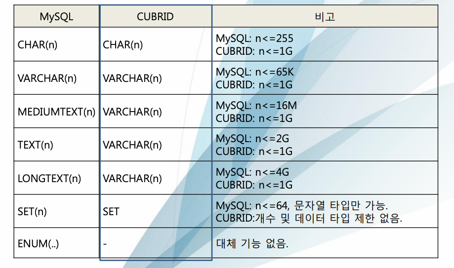
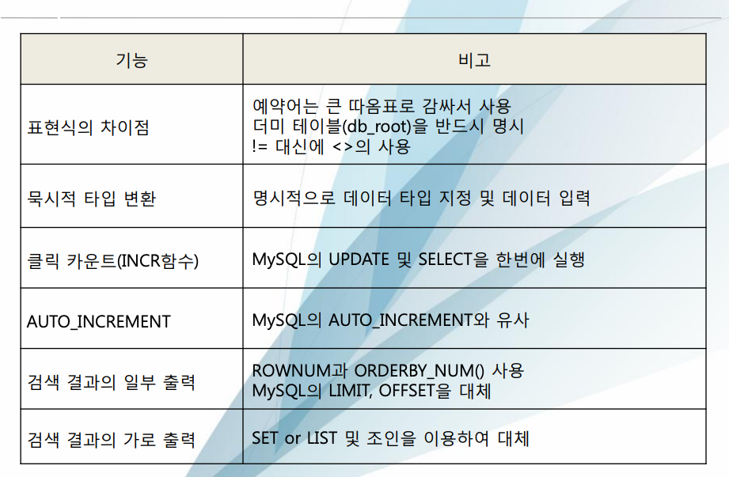

# MySQL vs Cubrid, 차이에 관하여...

- 일반 기능
- 데이터 타입
- 쿼리
- 함수

#### 그냥 이러이런게 다르다더라 정도로 보면 될 듯 하다. 전체 차이점도 아니다. 

## 일반 기능
| 범주 | MySQL | Cubrid |
|---|---|---|
| 테이블 내의 속성 수 | ~3398 | 제한 없음 |
| 레코드 크기 | ~65534   (BLOB, TEXT 별도) | 제한 없음 |
| 명명 규칙 (테이블, 뷰, 인덱스) | 대상_이름 | [소유자].대상_이름 |
| 데이터베이스 이름 | 도메인 내 고유 | 도메인 내 고유 | 
| 데이터베이스 이름 길이 | 64바이트 | 최대 17바이트 | 
| 테이블 이름 | 데이터베이스 사용자 계정 안에서 고유 | 데이터베이스 안에서 고유, 대소문자 구분 없음 | 

## 데이터 타입
- 대체적으로 비슷하지만, 다른 부분들이 있음
  - MySQL 에서 타입이 더 세분화하여 나뉘어져 있다.
    - Cubrid 는 BIT 가 BIT, BOOLEAN 을 커버
    - Cubrid 는 SMALLINT 가 TYNYINT, SMALLINT 를 커버
    - Cubrid 는 INTEGER 가 MEDIUMINT, INTEGER 를 커버
  - MySQL 은 BLOB 이 용량별로 4종류 이지만 Cubrid 는 2종류 

| MySQL | Cubrid | 비고 |
|---|---|---|
| BIT | BIT |  |
| BOOLEAN | BIT |  |
| TYNYINT | SMALLINT | tinyint -> 1byte,   smallint -> 2byte |
| SMALLINT | SMALLINT |  |
| MEDIUMINT | INTEGER | midiumint -> 3byte,   integer -> 4byte |
| INTEGER | INTEGER |  |
| BIGINT | BIGINT |  |
| REAL | REAL |  |
| DOUBLE | DOUBLE |  |
| DOUBLE PRECISION | DOUBLE PRECISION |  |
| FLOAT(n) | FLOAT(n) |  |
| DECIMAL(p,s),   NUMERIC(p,s) | DECIMAL(p,s),   NUMERIC(p,s) |  |
| TINYBLOB <= 256 | BIT VARYING(n)   or   Large Object(GLO) | Cubrid 에서,   1G 이하는 BIT VARYING,   1G 이상은 GLO 대체 권장 |
| BLOB <= 65K | BIT VARYING(n)   or   Large Object(GLO) | Cubrid 에서,   1G 이하는 BIT VARYING,   1G 이상은 GLO 대체 권장 |
| MEDIUMBLOB <= 16M | BIT VARYING(n)   or   Large Object(GLO) | Cubrid 에서,   1G 이하는 BIT VARYING,   1G 이상은 GLO 대체 권장 |
| LONGBLOB <= 4G | BIT VARYING(n)   or   Large Object(GLO) | Cubrid 에서,   1G 이하는 BIT VARYING,   1G 이상은 GLO 대체 권장 |
| DATE | DATE | MySQL: date -> 3byte   Cubrid: date -> 4byte |
| DATETIME | DATETIME | |
|TIME | TIME | MySQL: time -> 3byte   Cubrid: time -> 4byte |
| TIMESTAMP | TIMESTAMP | Cubrid: 초단위 연산만 지원 |
| YEAR | - | Cubrid: VARCHAR(4) 로 대체 | 
- 문자 관련 데이터타입

## 함수
- 이름이 동일하여도 용법에서 차이나는 것도 있고.. 사용하며 다시 봐야함. 그냥 이런게 있다더라 정도만 알면 될 듯 하다.

| MySQL | Cubrid |
|---|---|
| NOW | SYSTIMESTAMP |
| CURRENT_DATE | CURRENT_DATE or SYSDATE or SYS_DATE |
| CURRENT_TIME | CURRENT_TIME or SYSTIME or SYS_TIME |
| IFNULL | NVL |
| LOCATE | POSITION |
| LEFT | SUBSTR |
| != 또는 <> | <> |
| CONCAT 또는 + | + 또는 or문자 |

## 쿼리
- 가장 차이가 느껴졌던 것만 추린다면,
  - MySQL 은 묵시적인 타입변환이 지원되지만, Cubrid 는 데이터타입의 명시적인 변환이 필요하다.
  - Cubrid 는 subquery 에서 구문 외부의 alias 등을 참조할 수 있으나, MySQL 에서는 같은 쿼리를 사용하면 참조할 수 없다는 에러가 나서 수정했음
    - 찾아보니.. mysql 은 2 depth 이상 차이의 외부 alias 는 참조 불가하다고 함
  - GROUP BY 관련 사용 불가한 경우가 있었음 (mysql 에서)

## 정리

---

#### Reference
- https://www.cubrid.com/education_materials
  - 다만, 오래전 자료라서 이 후의 변화는 사용하게 된다면 다시 찾아보아야 한다.
