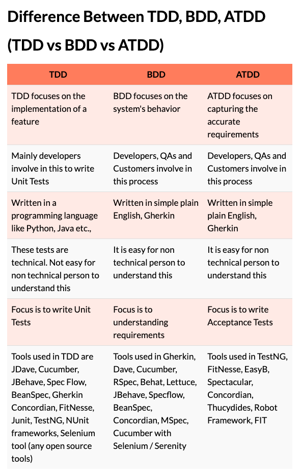

## TDD
- 기능 구현에 포커싱 한다.
- 주로 개발자가 유닛테스트 작성에 포함된다.
- 프로그래밍 언어로 작성된다.
- 비개발직군이 이해하기 어렵다.
- 유닛테스트 작성에 포커싱 한다.

## BDD
- 시스템 행위에 포커싱 한다.
- 개발자, QA, 고객이 과정에 포함된다.
- 단순한 영어로 쓰여진다.
- 비개발직군이 이해하기 쉽다.
- 요구사항을 이해하는데 포커싱 한다. 

## ATDD
- 정확한 요구사항을 맞추는 것에 포커싱 한다.
- 개발자, QA, 고객이 과정에 포함된다.
- 단순한 영어로 쓰여진다.
- 비개발직군이 이해하기 쉽다.
- 인수테스트 작성에 포커싱 한다.
