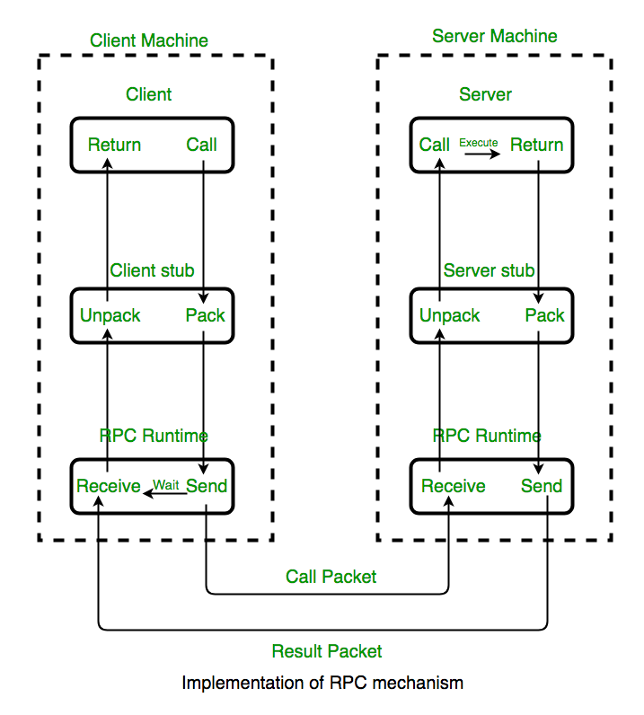

# RPC, 근데 이제 Json을 곁들인.. (Json-RPC)

- RPC 란 무엇인가?
- Json 이란 무엇인가?
- RPC 가 사용되는 이유
- RPC 동작 방식
- Json-RPC 특징

### RPC 란 무엇인가?
#### Remote Procedure Call (원격 프로시져 호출)
~~~
 언어나 환경 등에 종속되지 않고 서비스 간 프로시저를 호출하도록 해주는 개념
~~~
- 분산컴퓨팅 환경에서 많이 사용됨
- 프로세스 간 통신 (Inter-Process Communication) 의 한 형태
- 클라이언트-서버 관계로 요청-응답 시스템
- 클라이언트에서 서버로 필요한 파라미터를 보내어 프로시저를 동작시킨다.

### RPC 가 사용되는 이유
- 로컬/리모트 환경에 관계없이 똑같이 코딩 할 수 있음
- 환경에 구애받지 않고 동일 코딩으로 동일 프로시저 동작 시킬 수 있음
- HTTP 는 어플리케이션 레이어 (7계층) 에서 동작하는 것과 다르게, RPC 는 TCP (4계층) 위에서 동작한다.
  - 따라서 더 다양한 프로토콜 사용 가능하다
  - CRUD 외에 다양한 동작 표현

### RPC 동작방식

1. 클라이언트는 클라이언트 Stub 을 호출한다.
   - 스택에 매개변수를 푸시하는 로컬 프로시저 콜
2. 클라이언트 Stub 은 메시지로 매개변수를 패킹하고 메시지를 전송하는 시스템 호출
   - 이 때, 매개변수 패킹하는 것을 마샬링(Marshalling)이라 한다.
3. 클라이언트 로컬 OS 는 클라이언트에서 서버로 메시지 보낸다.
4. 서버 로컬 OS 는 들어오는 패킷을 서버 Stub 으로 보낸다.
5. 서버 Stub 은 메시지에서 매개변수 압축을 언패킹 한다.
   - 이 때, 매개변수 압축 푸는 것을 언마샬링(Unmarshalling) 이라 한다.
6. 서버 Stub 은 서버 프로시저를 호출한다.
7. 응답과 반환패킷은 반대 방향으로 동일한 단계를 거친다.

### Json 이란 무엇인가?
#### JavaScript Object Notation
- 데이터 교환 형식의 포맷
- Key / Value 쌍으로 콜렉션 타입으로 구성됨
- 예시 (below)
```json5
{
  "widget": {
    "debug": "on",
    "window": {
      "title": "Sample Konfabulator Widget",
      "name": "main_window",
      "width": 500,
      "height": 500
    },
    "image": {
      "src": "Images/Sun.png",
      "name": "sun1",
      "hOffset": 250,
      "vOffset": 250,
      "alignment": "center"
    },
    "text": {
      "data": "Click Here",
      "size": 36,
      "style": "bold",
      "name": "text1",
      "hOffset": 250,
      "vOffset": 100,
      "alignment": "center",
      "onMouseUp": "sun1.opacity = (sun1.opacity / 100) * 90;"
    }
  }
}
```

### Json-RPC 특징
- RPC 를 Json 포맷으로 표현한 것

### 추가로 나중에 볼 것
- 구글에서 만든 gRPC 를 많이들 쓰는 것으로 보임 

--- 
#### Reference
https://en.wikipedia.org/wiki/Remote_procedure_call
https://www.jsonrpc.org/
https://www.json.org/json-en.html
https://www.geeksforgeeks.org