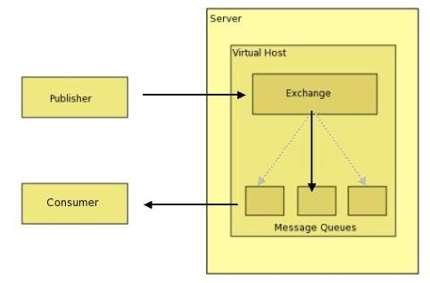
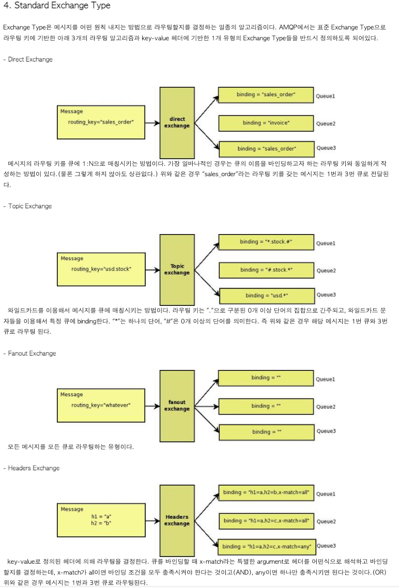
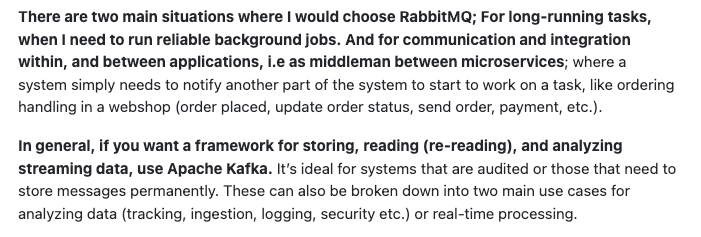
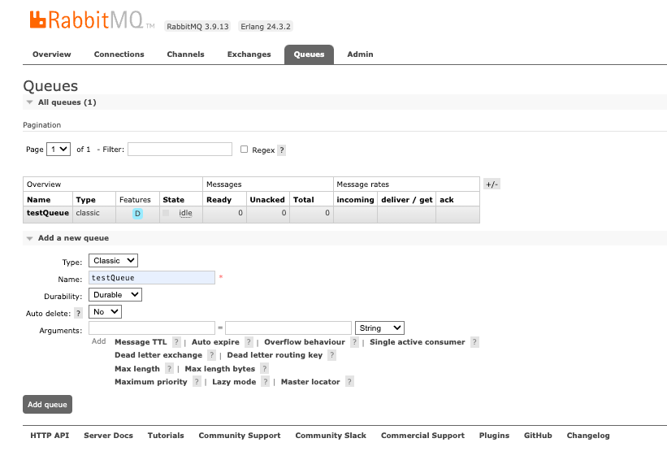
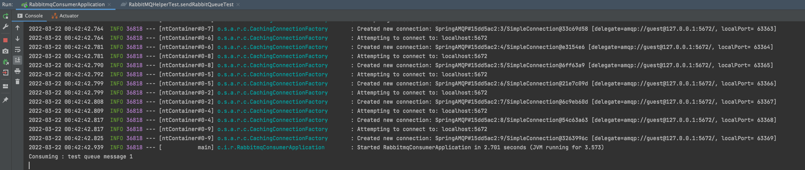

# RabbitMQ 간단 정리

- AMQP 란? 
  - 배경
  - 목적
  - 특징
  - 구성

- 그래서 Rabbit MQ 란?

- RabbitMQ vs Kafka
  - RabbitMQ
  - Kafka

- RabbitMQ 실행 샘플

- Reference

---

## AMQP 란?
- Advanced Message Queuing Protocol.
  - 위키에 따르면, 메시지 지향 미들웨어를 위한 개방형 표준 응용계층 `프로토콜`
- 배경
  - 기존 MQ 프로토콜들은 서로 다른 플랫폼 간의 메시지 교환을 위해서는 별도 작업 추가 (속도 저하), 또는 플랫폼 통일 등이 필요했음
- 목적
  - AMQP 는 서로 다른 시스템간에 (비용/기술/시간적인 측면에서) 최대한 효율적인 방법으로 메시지를 교환하기 위해 나온 MQ `프로토콜`
- 특징
  - 모든 `Broker` 들은 똑같은 방식으로 동작할 것
  - 모든 `Client` 들은 똑같은 방식으로 동작할 것
  - 네트웍상으로 전송되는 명령어들의 표준화
  - 프로그래밍 언어 중립적
- 구성
  - 아래 그림에서, 큰 상관은 없을 것 같지만 Publisher 는 `Producer` 로 바꾸는게 나을 것 같고.. Server 는 `Broker`로 보면 될 것 같다. 
  - 
  - Exchange: `Producer` 에서 수신한 메시지를 적절한 `Queue` 또는 다른 `Exchange` 로 분배하는 라우터의 기능을 한다. 
    - 각 `Queue` 나 `Exchange` 는 `Binding`을 사용해서 `Exchange` 에 바인드 되어 있고, 따라서 `Exchange` 는 수신한 메시지를 이 `Binding` 에 따라 적당한 `Queue`나 `Exchange`로 라우팅한다. 
    - `Binding` 과 메시지를 매칭시키기 위한 라우팅 알고리즘을 정의한것을 `Exchange type`이라고 하고, `Exchange type`은 라우팅 알고리즘의 클래스이다. `Broker`는 여러개의 exchange type 인스턴스를 가질 수 있다. `Binding`과 `Exchange type`이 혼동될 수 있는데, 
      - `Exchange type`은 메시지를 어떤 방법으로 라우팅 시킬지를 결정하는 것이고, `Binding`은 이러한 방법을 이용해 실제로 어떤 메시지를 어떤 큐에 보낼지를 결정하는 라우팅 테이블이라고 할 수 있다. 
    - ex) 명함정보가 들어오면 그것을 특정 `Queue`로 보내는 `Broker`가 존재한다면, 명함의 사람 이름 성씨를 보고 `Queue`를 결정하겠다는 것은 `Exchange type`이고, 김씨는 1번큐, 박씨는 2번큐, 이씨는 3번큐로 보내겠다는 것은 `Binding`이다.
  - Queue: 일반적으로 알고있는 큐이다. 메모리나 디스크에 메시지를 저장하고, 그것을 `Consumer`에게 전달 
    - `Queue` 는 스스로가 관심있는 메시지 타입을 지정한 `Binding` 을 통해 `Exchange` 에 말그대로 bind 된다.
  - Binding: `Exchange` 와 `Queue`와의 관계를 정의한 일종의 라우팅 테이블이다. 하나의 `Queue`가 여러개의 `Exchange`에 bind 될 수도 있고, 하나의 `Exchange`에 여러개의 `Queue`가 bind 될 수도 있다.
  - Routing Key: `Producer` 에서 송신한 메시지 헤더에 포함되는 것으로 일종의 `가상주소`라고 보면 된다. `Exchange`는 이것을 이용해서 어떤 `Queue`로 메시지를 라우팅할지 결정할 수 있다. (이것을 사용하지 않고 다른 룰을 이용할 수도 있음) 
    - AMQP의 표준 `Exchange type`은 이 라우팅 키를 이용하도록 되어있다.
  - Standard Exchange Type: 대부분의 MQ 에서 가능한 여러가지 상황에 대하여 AMQP 에서 정의한 `표준 라우팅 알고리즘`
    - 외우기 보다는.. 브로커 구성 시 아래 내용 참조  
    - 

<br>

## 그래서 RabbitMQ 란?
- Erlang 과 Java 로 AMQP 를 맞추어 구현한 메시지 큐 (MQ) 
  - 여기서 메시지 큐란?
    - 위키에 메시지큐를 찾으면, OS 에서 Input device 등의 입력 메시지를 저장해두는 대기열로 쓰는 큐 설명같은 것이 나오는데..
    - 그보다는 시스템 간의 메시지 교환을 위해 중간에 있는 큐 자료형의 메시지 대기열 로 보면 될 것 같다.

<br>

## RabbitMQ vs Kafka (일단, 둘 다 나온지 오래되어 (2007 vs 2011) 안정적임)
- RabbitMQ
  - 마이크로 서비스 간의 메시지 브로커 역할
  - 백그라운드 작업 처리 (장시간, 부하높은 작업들)
  - Scale-up 을 고려한 설계
  - `Message broker` 방식
    - 메시지 브로커는 시스템, 프로그램 등이 정보를 교환할 수 있도록 하는 모듈
    - 메시지를 보낸 `Producer` 이 메시지를 받는 `Consumer` 의 개수, 활성여부 등 정보를 몰라도 메시지 보낼 수 있음 
  - 
- Kafka 는 pub/sub 방식
  - 메시지를 `Record` 라고 부르기도 함
  - 처리량이 많은 데이터 스트림 처리 및 재생 등의 실시간 처리 동작에 적합
  - 많은 양의 데이터 보관 및 배하도록 설계 됨
  - Scale-out 을 고려한 설계
  - 
- 대략 아래를 고려해서 선택하면 된다.
  - 

<br>

## RabbitMQ 실행 샘플
0.1. https://github.com/itdar/TIL/tree/main/java/rabbitmq-consumer 다운 및 IDE 로드  
0.2. https://github.com/itdar/TIL/tree/main/java/rabbitmq-producer 다운 및 IDE 로드

1. docker 설치 (OS 에 맞게)
2. docker 에서 rabbitmq:management 이미지 다운로드
```shell
docker pull rabbitmq:management
```
3. docker 에서 다운받은 이미지 실행
```shell
docker run -d --name rabbitmq -p 5672:5672 -p 5673:5673 -p 15672:15672 rabbitmq:management
```
4. RabbitMQ gui 접속
```
http://localhost:15672

// id: guest
// pw: guest
```
5. RabbitMQ 에서 `Queue` 생성 (이름은 testQueue, 아래 그림 참조)

6. IDE 에서 Consumer App 실행
7. IDE 에서 Producer 의 RabbitMQHelperTest 클래스 테스트메서드 실행해서 메시지 보내기
8. consumer 에서 출력되는 메시지 확인



## Reference
https://ko.wikipedia.org/wiki/AMQP  
http://egloos.zum.com/killins/v/3025514  
https://coding-nyan.tistory.com/129  
https://www.cloudamqp.com/blog/when-to-use-rabbitmq-or-apache-kafka.html  
https://stackoverflow.com/questions/42151544/when-to-use-rabbitmq-over-kafka/42154452#42154452  

---

래빗큐 대상으로 쓰다보니 카프카에 대해서는 제대로 안읽어보고 차이점만 가볍게 읽어서 카프카에 대한 특이점이나 사용처가 딱히 제대로 와닿지는 않는다.
