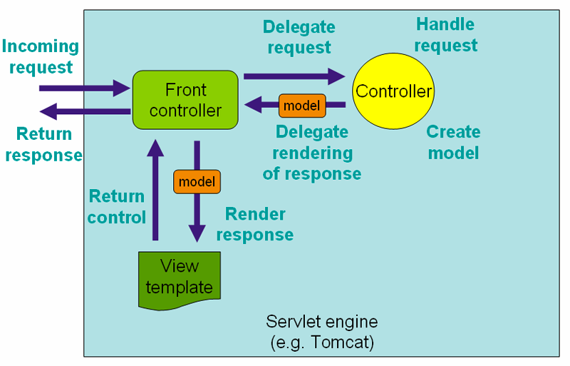
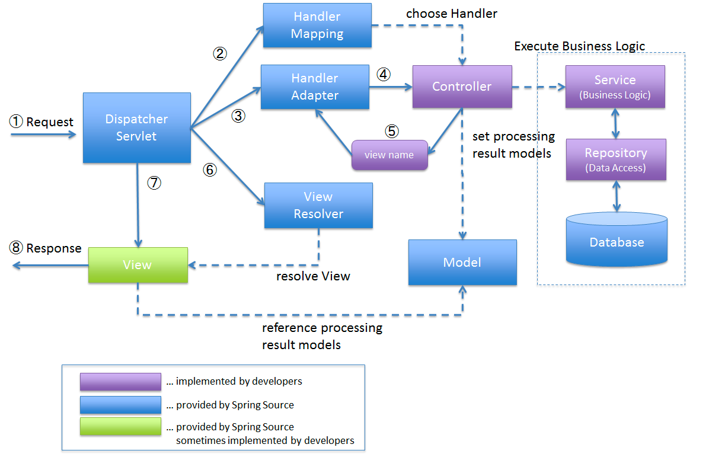

# Dispatcher Servlet 에 관하여..

- 스프링 뿐만 아니라 대부분의 web MVC 프레임워크들은, 요청을 웹어플리케이션의 다른 컨트롤러나 기능제공 부분에 전달(dispatch) 해주는 센터 서블릿을 두고 디자인 되어있다.
- 스프링의 DispatcherServlet 은 Spring IoC Container 와 완벽히 통합되는 등 스프링이 제공하는 아주 많은 기능들을 사용할 수 있게 해준다.
- 프론트컨트롤러 패턴으로 부를 수도 있고, 다른 많은 MVC 프레임워크들이 영향 받았다.

- 아래는 스프링공식문서에서의 워크플로우이고, 이 중 프론트컨트롤러가 DispatcherServlet.

  

- 좀 더 상세하게 동작 방식을 본다면,

1. DispatcherServlet receives the request.
   1. `디스패처서블릿`이 `요청`을 받는다.
2. DispatcherServlet dispatches the task of selecting an appropriate controller to HandlerMapping. HandlerMapping selects the controller which is mapped to the incoming request URL and returns the (selected Handler) and Controller to DispatcherServlet.
   2. 디스패처서블릿은 적절한 `컨트롤러`를 고르는 작업을 `핸들러매핑`에게 넘긴다. 핸들러매핑은 요청 URL 과 매핑되는 컨트롤러를 찾고 핸들러와 컨트롤러를 디스패처서블릿에 넘겨준다. 
3. DispatcherServlet dispatches the task of executing of business logic of Controller to HandlerAdapter.
   3. 디스패처서블릿은 컨트롤러의 비지니스로직의 실행 작업을 `핸들러어댑터`에게 넘겨준다.
4. HandlerAdapter calls the business logic process of Controller.
   4. 핸들러어댑터는 컨트롤러의 비지니스 로직 과정을 호출한다.
5. Controller executes the business logic, sets the processing result in Model and returns the logical name of view to HandlerAdapter.
   5. 컨트롤러는 비지니스 로직을 실행하고, 결과를 모델에 저장하고, `뷰`의 이름을 핸들러어댑터에게 전달한다. 
6. DispatcherServlet dispatches the task of resolving the View corresponding to the View name to ViewResolver. ViewResolver returns the View mapped to View name.
   6. 디스패처서블릿은 뷰 네임에 맞는 뷰를 찾는 작업을 `뷰리졸버`에 전달한다. 뷰리졸버는 뷰 이름에 매핑되는 뷰를 반환한다.
7. DispatcherServlet dispatches the rendering process to returned View.
   7. 디스패처서블릿은 반환될 뷰에 대한 `렌더링` 프로세스를 진행한다. 
8. View renders Model data and returns the response.
   8. 뷰는 모델데이터를 렌더링하고, `응답`을 반환한다.

---

### Reference
- https://docs.spring.io/spring-framework/docs/4.1.7.RELEASE/spring-framework-reference/html/mvc.html
- https://terasolunaorg.github.io/guideline/5.0.1.RELEASE/en/Overview/SpringMVCOverview.html#overview-of-spring-mvc-processing-sequence

